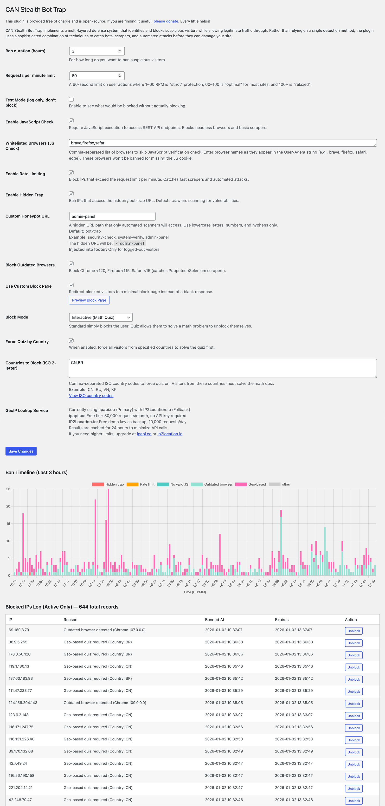

# CAN Stealth Bot Trap

## Description

CAN Stealth Bot Trap is a Wordpress plugin that implements a multi-layered defense system that identifies and blocks suspicious visitors while allowing legitimate traffic through. Rather than relying on a single detection method, the plugin uses a sophisticated combination of techniques to catch bots, scrapers, and automated attacks before they can cause damage or eat up your bandwidth or CPU.

The plugin operates transparently to real visitors—most legitimate users won't even notice it's running. Only when suspicious behavior is detected does the visitor encounter a challenge (optional math quiz) to prove they're human.

Note: Althought I found adding disallow:/ user-agents to the robots.txt pretty useless when trying to protect the site from scrapers and bots, it is still highly recommended. There are other many plugins out there that will do this for you.

This plugin is provided free of charge and is open-source. If you are finding it useful, [please donate](https://buy.stripe.com/3cscNx6469g00Sc288). Every little helps!

## Features

### Core Protection Layers

- **Ban Management** - Maintains an active ban list with configurable ban duration (default: 6 hours). Fast transient-based lookups ensure minimal performance impact.

- **Hidden Trap Detection** - Customizable honeypot URL that only automated scanners access. Any bot probing for vulnerabilities is automatically banned. Configure your own unique URL path in the admin settings.

- **Rate Limiting** - Protects against brute force and resource exhaustion attacks. Configurable requests-per-minute limit (default: 80 RPM). Catches fast scrapers and DDoS attempts.

- **JavaScript Verification** - Requires JavaScript execution to access REST API endpoints. Blocks headless browsers and basic scrapers that can't execute code. Option to whitelist specific browsers (Brave, Firefox, Safari).

- **Outdated Browser Detection** - Blocks outdated browser versions commonly used in automated attacks:
  - Chrome < 120
  - Firefox < 115
  - Safari < 15
  - Catches Puppeteer and Selenium-based scrapers

- **Geo-Based Quiz** - Optionally and temporarily force visitors from specified countries to solve a verification quiz. It is often that these bots alternate IPs but come from the same country. Here, you can enable this temporarily to catch them all and force the quiz. Uses cached GeoIP lookup to minimize API calls. Perfect for targeting high-risk regions.

- **IP Whitelist** - Maintain a whitelist of trusted IP addresses and CIDR ranges that bypass all protection checks. Perfect for payment processors, third-party webhooks, APIs, and trusted partners.

- **IP Blacklist** - Permanently block known malicious IP addresses and CIDR ranges. Blacklisted IPs are denied at the server level via `.htaccess` before WordPress or the page cache loads — zero processing cost. The blacklist is automatically synced to `.htaccess` whenever you save the settings. Supports both exact IPs and CIDR ranges with `#` comment support.

- **Webhook Support** - PayPal, Stripe, and WooCommerce webhooks are automatically whitelisted via their request paths, so they work out of the box without needing IP configuration.

### Block Modes

- **Standard Mode** - Simply denies access with a minimal block page. IP remains banned for the configured duration.

- **Interactive Quiz Mode** - Visitors can solve a simple math problem to unlock access. Allows legitimate users from suspicious patterns to prove they're human and immediately regain access.

### Management & Monitoring

- **Admin Dashboard** - Easy-to-use settings page with a protection status summary showing:
  - Enabled/disabled status of each protection layer with visual indicators
  - Current active ban count
  - Ban reason breakdown (top 3 reasons)
  - Last 24-hour statistics (unique IPs blocked and total blocks)

- **Subnet Attack Analysis** - Automatically analyses the active ban log to identify attacking IP ranges. When 20+ IPs from the same `/24` or `/16` subnet are banned, the subnet is surfaced as a suggested blacklist entry with a one-click "Add to Blacklist" button. Only runs when there are 20+ total banned IPs to avoid false positives.

- **Active Bans Log** - Displays all currently active IP bans with:
  - IP address
  - Ban reason (specific detection layer that triggered)
  - Ban timestamp
  - Expiration time
  - Quick unblock buttons

- **Ban Timeline Chart** - Visual timeline of bans over the last configured hours, color-coded by ban reason. Track patterns and see when attacks are happening.

- **Ban Management** - Manually unblock specific IPs or clear all bans without losing configuration.

- **Test Mode** - Preview what would be blocked without actually blocking visitors. Perfect for tuning thresholds.

- **Browser Whitelist** - Customize which browsers skip JavaScript verification to prevent false positives.

- **Custom Honeypot URL** - Configure your own unique honeypot path in the admin settings for additional obfuscation.

### IP Whitelist Management

- **Pre-configured Trusted IPs** - Comes with PayPal and Stripe webhook server IP ranges pre-loaded, so payments and third-party integrations work out of the box.

- **Easy to Customize** - Simple textarea interface where you can:
  - Add your own trusted IPs or CIDR ranges
  - Add inline comments to document why each IP is whitelisted
  - Delete or modify entries as needed
  - Support for both exact IPs (`192.168.1.100`) and CIDR ranges (`173.0.80.0/13`)

- **Comment Support** - Use `#` to add explanatory notes:
  - Full-line comments: `# PayPal Webhook Servers`
  - Inline comments: `54.187.174.169 # Stripe webhook server`

- **Webhook Bypass** - Whitelisted IPs automatically bypass all protection layers:
  - Rate limiting
  - JavaScript verification
  - Ban checks
  - Geo-locking
  - Honeypot traps

### Performance & Optimization

- **Fast Transient Caching** - Ban statuses cached in transients for instant lookups (no database queries on every request).

- **GeoIP Caching** - Country lookups cached for 24 hours to minimize external API dependency.

- **Dual GeoIP Services** - Primary: ipapi.co (30k requests/month free). Fallback: IP2Location.io (10k requests/day free).

- **Hourly Cleanup** - Automatic cleanup of expired transients and rate limit records prevents database bloat.

- **Twice-Daily Database Cleanup** - Removes expired ban records from the database.

- **Minimal Fingerprinting** - Records request fingerprints for analysis without storing excessive data.

### Security Features

- **Nonce Protection** - All admin actions protected with WordPress nonces.

- **Permission Checks** - Only administrators can access settings and manage bans.

- **Input Sanitization** - All user inputs properly validated and escaped.

- **IP Validation** - Robust IP address detection supporting proxies and CDNs (via standard WordPress function).

---

## How It Works

The plugin runs a series of detection checks on every page load, in priority order:

1. **Whitelist Check** - Is this IP whitelisted (payment processor, API, trusted partner)?
2. **Ban Check** - Is this IP already banned?
3. **Hidden Trap** - Did they access the honeypot URL?
4. **Rate Limiting** - Too many requests too fast?
5. **JavaScript Verification** - Can they execute code?
6. **Outdated Browser** - Are they using a known scraper browser?
7. **Geo-Based Quiz** - Are they from a blocked country?

If any check fails, the visitor is banned and shown either a block page or interactive quiz (depending on your settings). Whitelisted IPs skip all checks entirely.

### Key Design Philosophy

- **Fail-fast approach** - Stop malicious visitors as early as possible
- **Whitelist-first** - Trusted partners and payment processors always get through
- **Minimize geo checks** - GeoIP lookups only happen after all local checks pass
- **Transparent to legitimate users** - Real visitors pass through undetected
- **Administrator control** - Fine-tune every aspect of protection

---

## Visitor Flow

### Legitimate Visitor
```
Visitor arrives → Whitelist check (not whitelisted, continue)
→ Ban check (pass) → Rate limit (pass) → JS check (pass)
→ Browser check (pass) → Geo check (pass) → Allowed through ✅
```

### Whitelisted IP (Payment Processor, API, etc.)
```
Visitor arrives → Whitelist check (PASS) → Bypass all checks → Allowed through ✅
```

### Bot / Scraper
```
Visitor arrives → Whitelist check (not whitelisted, continue)
→ Ban check → Rate limit (FAIL) → Banned → Block page shown ❌
```

### High-Risk Visitor from Blocked Country (with Geo Enabled)
```
Visitor arrives → Whitelist check (not whitelisted, continue)
→ Ban check (pass) → Rate limit (pass) → JS check (pass)
→ Browser check (pass) → Geo check (FAIL - Specific country detected) → Show quiz
→ Solves quiz correctly → Unblocked ✅
```

### Visitor Who Fails JavaScript Check
```
Visitor arrives → Whitelist check (not whitelisted, continue)
→ Ban check (pass) → Rate limit (pass)
→ JS check (FAIL - no JS execution) → Banned → Block page shown ❌
```

### Honeypot Triggered
```
Visitor accesses custom honeypot URL → Whitelist check (not whitelisted, continue)
→ Hidden trap check (FAIL) → Banned immediately → Block page shown ❌
```



---

## Configuration

### Basic Settings
- Ban duration (hours)
- Requests per minute limit
- Test mode (log only, don't block)
- Custom block page display

### IP Blacklist
- Add IP addresses or CIDR ranges to permanently block at server level
- Automatically synced to `.htaccess` on save — fires before WordPress and page cache
- Works behind reverse proxies via `X-Forwarded-For` header
- Support for inline `#` comments
- One-click adding of suggested subnets from the attack analysis panel

### IP Whitelist
- Pre-loaded with PayPal and Stripe webhook server IPs
- Add, edit, or delete trusted IP addresses and CIDR ranges
- Support for inline documentation with `#` comments
- Perfect for payment processors, webhooks, and APIs

### Detection Layers (Enable/Disable individually)
- JavaScript check
- Rate limiting
- Hidden trap
- Outdated browser detection
- Geo-based quiz

### Block Modes
- Standard (static block page)
- Interactive (math quiz challenge)

### Browser Whitelisting
- Customize which browsers skip JS verification

### Custom Honeypot URL
- Configure your own unique honeypot path (default: bot-trap)
- Only lowercase letters, numbers, and hyphens allowed
- Injected into footer for logged-out visitors only

### Geo-Blocking (Quiz Mode Only)
- Specify countries to force quiz requirement
- Configure GeoIP service (already set up)

---

## Admin Dashboard

The admin dashboard provides a quick overview of your site's protection status:

**Protection Status Summary**
- Visual indicators (🟩/⬜) for each enabled/disabled protection layer
- Current configured settings (rate limit, ban duration, etc.)
- Active ban statistics:
  - Total currently active bans
  - Top 3 ban reasons with counts
  - Last 24-hour unique IP count and total blocks

**Ban Timeline Chart**
- Visual bar chart showing bans over the last configured hours
- Color-coded by ban reason for easy pattern recognition
- Interactive tooltips showing details per time period

**Suggested Blacklist Entries**
- Automatically surfaces attacking subnets based on ban log analysis
- Shows `/24` and `/16` ranges with 20+ banned IPs from the same range
- One-click "Add to Blacklist" button per suggestion
- Only shown when ban log contains 20+ entries

**Blocked IPs Log**
- Paginated list of all active bans
- Quick unblock buttons for individual IPs
- Bulk unblock all action

---

## Folder Structure

```
can-stealth-bot-trap/
├── can-stealth-bot-trap.php          # Main plugin file
├── includes/
│   ├── class-stealth-bot-trap.php    # Core functionality & database management
│   ├── class-detection-layers.php    # Detection layer implementation
│   ├── class-admin.php               # WordPress admin interface
│   └── class-admin-dashboard.php     # Admin dashboard summary
├── templates/
│   └── blocked.php                   # Block page & quiz template (customize as you wish)
└── readme.md                         # Documentation
```

---

## Performance Impact

- **Minimal overhead** - All detection runs on WordPress `init` hook
- **Local checks only** - Most checks use fast, local PHP operations
- **Cached wherever possible** - Ban status and GeoIP lookups cached aggressively
- **Whitelisted IPs bypass all checks** - Payment processors and APIs have zero overhead
- **No effect on logged-in users** - Protection only applies to public visitors

---

## Requirements

- WordPress 5.0+
- PHP 7.4+
- MySQL 5.7+
- Outbound HTTPS access (for GeoIP lookups)

---

## License

This plugin is licensed under the **Creative Commons Attribution 4.0 International (CC BY 4.0)** license.

### You are free to:

- **Share** — Copy and redistribute the material in any medium or format
- **Adapt** — Remix, transform, and build upon the material for any purpose, even commercially (on your own site)

### Under the following terms:

- **Attribution** — You must give appropriate credit, provide a link to the license, and indicate if changes were made. You may do so in any reasonable manner, but not in any way that suggests the licensor endorses you or your use.
- **No Selling** — You may NOT offer this plugin for sale, whether directly or as a commercial product/service. This includes:
  - Selling as a standalone plugin
  - Bundling with paid products or services
  - Charging for access to the plugin code
  - Offering as a premium feature in a commercial service
- **No Additional Restrictions** — You may not apply legal terms or technological measures that legally restrict others from doing anything the license permits

### In Plain English:

Use this plugin freely on your own site, modify it, learn from it, and share it with others—but always credit the original authors and never charge money for it. If you improve it, we'd love to see your enhancements!

### Attribution Example:

```html
CAN Stealth Bot Trap by Creative Applications Network
https://github.com/[your-repo-url]
Licensed under Creative Commons Attribution 4.0 International (CC BY 4.0)
```

---

## Support

For issues, feature requests, or questions, please submit feedback or contact support through your WordPress admin panel.

---

**Built with security in mind. No selling. Just sharing.**
